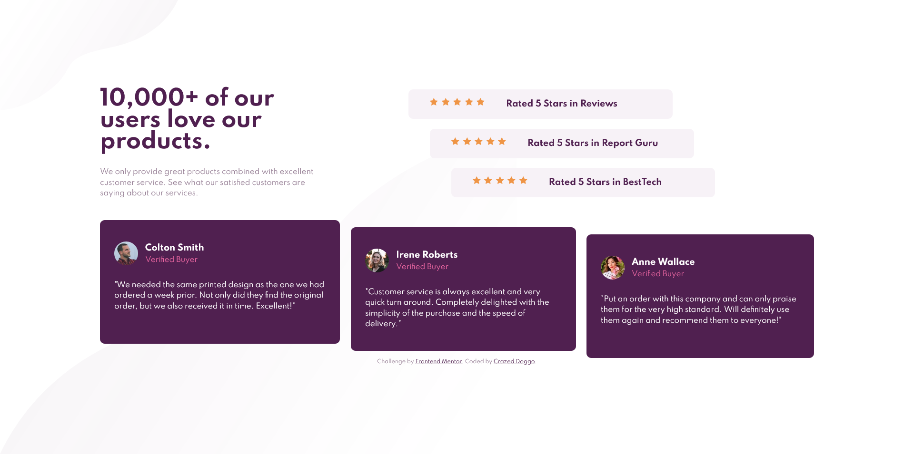

# Frontend Mentor - Social proof section solution

This is a solution to the [Social proof section challenge on Frontend Mentor](https://www.frontendmentor.io/challenges/social-proof-section-6e0qTv_bA). Frontend Mentor challenges help you improve your coding skills by building realistic projects. 

## Table of contents

- [Overview](#overview)
  - [The challenge](#the-challenge)
  - [Screenshot](#screenshot)
  - [Links](#links)
- [My process](#my-process)
  - [Built with](#built-with)
- [Author](#author)

## Overview

### The challenge

Users should be able to:

- View the optimal layout for the section depending on their device's screen size

### Screenshot

### Links

- Solution URL: [https://github.com/CrazedDoggo/FEM-Social-Proof-Section](https://github.com/CrazedDoggo/FEM-Social-Proof-Section)
- Live Site URL: [https://crazeddoggo.github.io/FEM-Social-Proof-Section/](https://crazeddoggo.github.io/FEM-Social-Proof-Section/)

## My process

I began with styling individual components and setting up my typography before moving onto the layout. I used a mixture of flexbox and grid for this, using flexbox for more individual elements such as the stars or lists while I used grid for the main layout or where I saw fit.

I utilized transforms to adjust the cards as shown in the design file. This maintained the layout that I built while still moving the elements in a non-disruptive way.

### Built with

- Semantic HTML5 markup
- CSS custom properties
- Flexbox
- CSS Grid
- Mobile-first workflow

## Author

- GitHub - [CrazedDoggo](https://github.com/CrazedDoggo)
- Frontend Mentor - [@CrazedDoggo](https://www.frontendmentor.io/profile/CrazedDoggo)
- Twitter - [@DoggoCrazed](https://www.twitter.com/DoggoCrazed)
